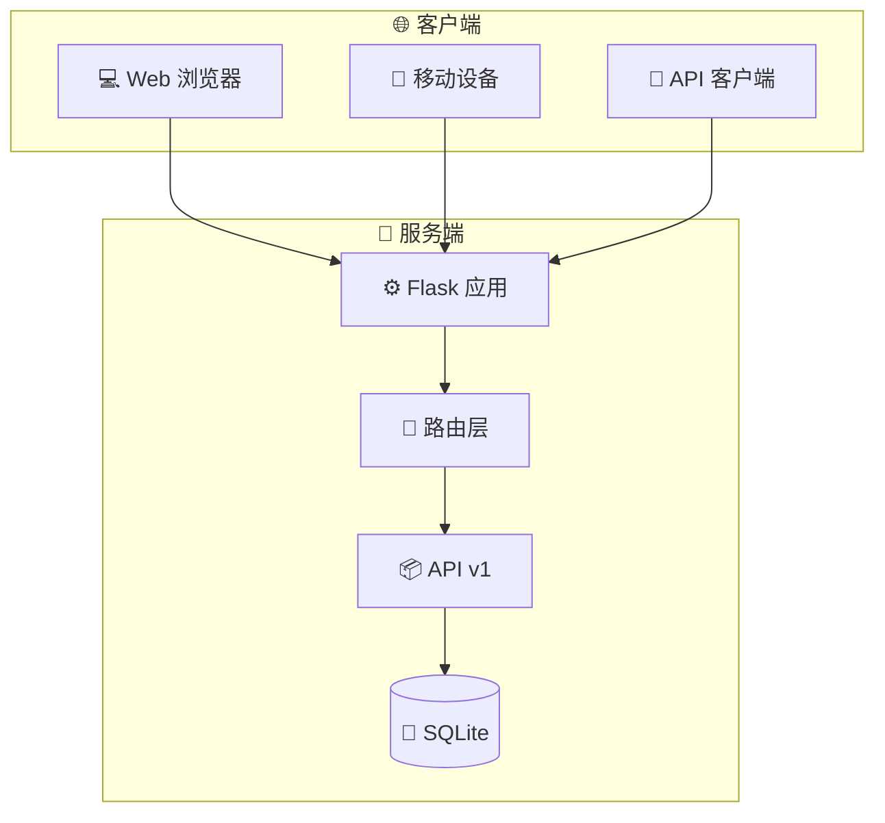

<!-- markdownlint-disable MD041 -->
<div align="center">

<picture>
  <source media="(prefers-color-scheme: dark)" srcset="https://img.shields.io/badge/21st_Agents_SDK-FFFFFF?style=for-the-badge&logo=github&logoColor=white&color=6366f1">
  <source media="(prefers-color-scheme: light)" srcset="https://img.shields.io/badge/21st_Agents_SDK-FFFFFF?style=for-the-badge&logo=github&logoColor=black&color=6366f1">
  
</picture>

# 🚀 21st Agents SDK - ProductHunt Demo

⚡ **现代化 UI** · 🔄 **交互式投票** · 📊 **RESTful API** · 💬 **评论系统**

[](https://github.com/none-ai/agents-sdk/stargazers)
[
[
[
[
[
[

---

[📖 文档](#快速开始) ·
[🚀 功能](#功能) ·
[💬 讨论](https://github.com/none-ai/agents-sdk/discussions) ·
[🐛 问题反馈](https://github.com/none-ai/agents-sdk/issues)

</div>

---

## ✨ 简介

一个强大的 Flask 应用，展示 21st Agents SDK 产品页面，包含现代化 UI、RESTful API 和交互式功能。

## 🏗️ 系统架构



## ✨ 功能

| 功能 | 描述 |
|------|------|
| 🎨 **现代化 UI** | 精美的响应式设计，渐变背景和流畅动画 |
| 🗳️ **交互式投票** | 每个 IP 地址只能投一票，防止重复 |
| 💬 **评论系统** | 用户可以留言并查看实时更新 |
| 🔌 **RESTful API** | 完整的 API，支持版本控制、速率限制和错误处理 |
| 📄 **多页面** | 主页、功能页、关于页 |
| ❤️ **健康监控** | 内置健康检查和统计端点 |

## 🚀 快速开始

### 安装

```bash
# 克隆仓库
git clone https://github.com/none-ai/agents-sdk.git
cd agents-sdk

# 创建虚拟环境（推荐）
python -m venv venv
source venv/bin/activate  # Linux/Mac
# 或
venv\Scripts\activate     # Windows

# 安装依赖
pip install -r requirements.txt

# 运行应用
python app.py
```

应用将在 `http://localhost:5000` 启动

### 使用 Docker（可选）

```bash
docker build -t agents-sdk .
docker run -p 5000:5000 agents-sdk
```

## 📡 API 端点

### 页面路由

| 路由 | 描述 |
|------|------|
| `/` | 主页，包含产品信息和投票 |
| `/features` | 功能展示页 |
| `/about` | 关于页面，包含团队和时间线 |

### API 端点

| 方法 | 端点 | 描述 |
|------|------|------|
| GET | `/api/product` | 获取产品信息 |
| PUT | `/api/product` | 更新产品（管理员） |
| POST | `/api/vote` | 投票 |
| GET | `/api/vote/status` | 检查投票状态 |
| GET | `/api/comments` | 获取所有评论 |
| POST | `/api/comments` | 添加新评论 |
| GET | `/health` | 健康检查端点 |
| GET | `/stats` | 获取统计信息 |

### API 示例

```bash
# 获取产品信息
curl http://localhost:5000/api/product
```

响应：
```json
{
  "success": true,
  "data": {
    "name": "21st Agents SDK",
    "tagline": "Build intelligent AI agents with ease",
    "votes": 420
  },
  "api_version": "v1"
}
```

```bash
# 投票
curl -X POST http://localhost:5000/api/vote
```

```bash
# 添加评论
curl -X POST http://localhost:5000/api/comments \
  -H "Content-Type: application/json" \
  -d '{"name": "Your Name", "content": "Your comment"}'
```

## ⚙️ 配置

### 环境变量

| 变量 | 描述 | 默认值 |
|------|------|--------|
| `PORT` | 服务器端口 | 5000 |
| `DEBUG` | 调试模式 | False |
| `SECRET_KEY | 管理员操作密钥 | - |

## 🛠️ 开发

```bash
# 安装测试依赖
pip install pytest

# 运行测试
pytest

# 使用 gunicorn 运行
gunicorn -w 4 -b 0.0.0.0:5000 app:app
```

## 📚 技术栈

- **后端**: Flask 3.0
- **服务器**: Gunicorn
- **测试**: Pytest
- **数据库**: SQLite

## 🤝 贡献

欢迎贡献！请阅读 [CONTRIBUTING.md](CONTRIBUTING.md) 了解如何参与贡献。

## 📄 许可证

MIT

---

**作者**: stlin256's openclaw
